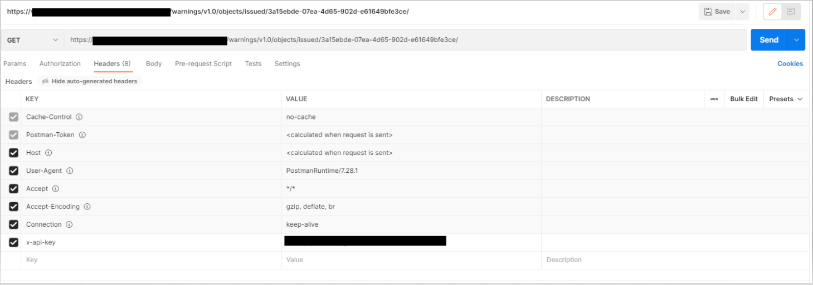

# Issued

| **GET** | `https://<api base path>/warnings/v1.0/objects/issued/{AtomEntryId}` |

Retrieves a feature collection of latest warnings in a geojson format.

The api base path in the above endpoint depends on the environment that you're working in.

### headers
`x-api-key` - the key for authenticating your API request.

### response:
`200` with the feature collection containing the latest versions of all warnings issued for the next 7 days at a point when warnings were last issued. It will be in a geojson format. This collection will not include `EXPIRED` and `CANCELLED` warnings.  Results will be ordered primarily by Risk (Highest risk first) and then chronologically by validFrom date. The risk order looks primarily at warningLevel (`RED` > `AMBER` > `YELLOW`) then by warningImpact and finally by warningLikelihood (i.e. the position in the Risk Matrix - see style guide for more information). The AtomFeedId identifies a unique link and only one link will be available. The link to the most recent issued warnings should be taken from the Atom feed.

`403` authentication has failed, is your API key correct?

`404` the atom feed is either no longer available or is incorrect.

### example
Making a request



<details>
<summary>Successful response with some latest warnings</summary>

```json
{
    "type": "FeatureCollection",
    "features": [
        {
            "type": "Feature",
            "properties": {
                "issuedDate": "2022-06-14T13:31:45Z",
                "weatherType": [
                    "LIGHTNING"
                ],
                "warningLikelihood": 4,
                "warningLevel": "AMBER",
                "warningStatus": "ISSUED",
                "warningHeadline": "TEST SCENARIO - NOT FOR OPERATIONAL USE. OpC. CB",
                "whatToExpect": [
                    "Injuries and danger to life from lightning strikes"
                ],
                "warningId": "624fdca5-eaaa-441d-bedf-69e2d62c6a3e",
                "warningVersion": "1.0",
                "warningFurtherDetails": "This is a test, please ignore. CB",
                "modifiedDate": "2022-06-14T13:31:45Z",
                "validFromDate": "2022-06-14T13:31:00Z",
                "affectedAreas": [
                    {
                        "regionName": "East Midlands",
                        "regionCode": "EM",
                        "subRegions": [
                            "Derby",
                            "Derbyshire",
                            "Leicester",
                            "Leicestershire",
                            "Lincolnshire",
                            "Northamptonshire",
                            "Nottingham",
                            "Nottinghamshire",
                            "Rutland"
                        ]
                    },
                    {
                        "regionName": "East of England",
                        "regionCode": "EE",
                        "subRegions": [
                            "Bedford",
                            "Cambridgeshire",
                            "Central Bedfordshire",
                            "Essex",
                            "Hertfordshire",
                            "Luton",
                            "Norfolk",
                            "Peterborough",
                            "Southend-on-Sea",
                            "Suffolk",
                            "Thurrock"
                        ]
                    },
                    {
                        "regionName": "London & South East England",
                        "regionCode": "SE",
                        "subRegions": [
                            "Bracknell Forest",
                            "Brighton and Hove",
                            "Buckinghamshire",
                            "East Sussex",
                            "Greater London",
                            "Hampshire",
                            "Isle of Wight",
                            "Kent",
                            "Medway",
                            "Milton Keynes",
                            "Oxfordshire",
                            "Portsmouth",
                            "Reading",
                            "Slough",
                            "Southampton",
                            "Surrey",
                            "West Berkshire",
                            "West Sussex",
                            "Windsor and Maidenhead",
                            "Wokingham"
                        ]
                    },
                    {
                        "regionName": "North West England",
                        "regionCode": "NW",
                        "subRegions": [
                            "Cheshire East",
                            "Cheshire West and Chester",
                            "Greater Manchester",
                            "Halton",
                            "Merseyside",
                            "Warrington"
                        ]
                    },
                    {
                        "regionName": "South West England",
                        "regionCode": "SW",
                        "subRegions": [
                            "Bath and North East Somerset",
                            "Bournemouth Christchurch and Poole",
                            "Bristol",
                            "Devon",
                            "Dorset",
                            "Gloucestershire",
                            "North Somerset",
                            "Somerset",
                            "South Gloucestershire",
                            "Swindon",
                            "Wiltshire"
                        ]
                    },
                    {
                        "regionName": "Wales",
                        "regionCode": "WL",
                        "subRegions": [
                            "Blaenau Gwent",
                            "Bridgend",
                            "Caerphilly",
                            "Cardiff",
                            "Carmarthenshire",
                            "Ceredigion",
                            "Conwy",
                            "Denbighshire",
                            "Flintshire",
                            "Gwynedd",
                            "Isle of Anglesey",
                            "Merthyr Tydfil",
                            "Monmouthshire",
                            "Neath Port Talbot",
                            "Newport",
                            "Pembrokeshire",
                            "Powys",
                            "Rhondda Cynon Taf",
                            "Swansea",
                            "Torfaen",
                            "Vale of Glamorgan",
                            "Wrexham"
                        ]
                    },
                    {
                        "regionName": "West Midlands",
                        "regionCode": "WM",
                        "subRegions": [
                            "Herefordshire",
                            "Shropshire",
                            "Staffordshire",
                            "Stoke-on-Trent",
                            "Telford and Wrekin",
                            "Warwickshire",
                            "West Midlands Conurbation",
                            "Worcestershire"
                        ]
                    },
                    {
                        "regionName": "Yorkshire & Humber",
                        "regionCode": "YH",
                        "subRegions": [
                            "North East Lincolnshire",
                            "North Lincolnshire",
                            "South Yorkshire"
                        ]
                    }
                ],
                "warningImpact": 3,
                "validToDate": "2022-06-15T22:59:59Z"
            },
            "geometry": {
                "type": "MultiPolygon",
                "coordinates": [
                    [
                        [
                            [
                                1.7358,
                                53.2915
                            ],
                            [
                                -0.6812,
                                53.5011
                            ],
                            [
                                -2.3511,
                                53.5011
                            ],
                            [
                                -4.5483,
                                53.2521
                            ],
                            [
                                -5.7568,
                                53.0016
                            ],
                            [
                                -5.9546,
                                52.9354
                            ],
                            [
                                -6.1084,
                                52.8293
                            ],
                            [
                                -6.3501,
                                52.1739
                            ],
                            [
                                -6.3501,
                                51.5907
                            ],
                            [
                                -6.3062,
                                51.4951
                            ],
                            [
                                -6.0645,
                                51.3031
                            ],
                            [
                                -3.5156,
                                51.0552
                            ],
                            [
                                -3.1421,
                                51.0552
                            ],
                            [
                                -0.9668,
                                50.5972
                            ],
                            [
                                0.5933,
                                50.5972
                            ],
                            [
                                0.9448,
                                50.639
                            ],
                            [
                                1.1646,
                                50.8059
                            ],
                            [
                                3.3398,
                                51.069
                            ],
                            [
                                3.8232,
                                50.6808
                            ],
                            [
                                4.6362,
                                50.4015
                            ],
                            [
                                4.7021,
                                50.4015
                            ],
                            [
                                4.7241,
                                50.8198
                            ],
                            [
                                4.5044,
                                51.3306
                            ],
                            [
                                3.186,
                                52.8028
                            ],
                            [
                                2.9663,
                                52.9619
                            ],
                            [
                                2.5269,
                                53.1204
                            ],
                            [
                                1.7358,
                                53.2915
                            ]
                        ]
                    ]
                ]
            }
        }
    ]
}
```
</details>

<details>
<summary>Successful response with no latest warnings</summary>

```json
{"type":"FeatureCollection","features":[]}
```
</details>
